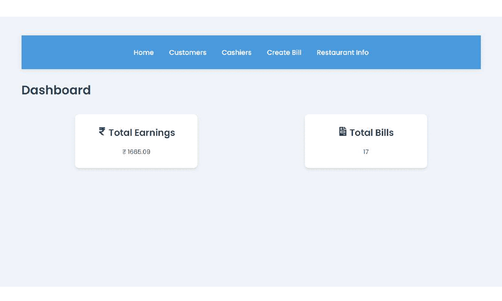

<table style="border: 0; border-collapse: collapse;">
  <tr>
    <td style="border: 0;"></td>
    <td style="border: 0;"><h2 style="margin: 0;">Billing System React App</h2></td>
  </tr>
</table>


# 🧾 Interactive Billing System

Welcome to our state-of-the-art Billing System! This user-friendly application streamlines your billing process with just a few clicks.

Here are the wireframes for my project:



## 🌟 Features

- **Intuitive Interface**: Navigate effortlessly through our clean, modern design.
- **One-Click Billing**: Generate professional invoices in seconds.
- **Customer Management**: Easily add, edit, and organize customer information.
- **Product Catalog**: Maintain a comprehensive list of your products and services.
- **Multi-Currency Support**: Work with multiple currencies seamlessly.
- **Cloud Sync**: Access your data from anywhere, anytime.

## 🚀 Getting Started

1. **Installation**:
   ```
   git clone https://github.com/harsk03/billing-system.git
   cd billing-system
   npm install
   ```

2. **Launch the Application**

    a. **Frontend**
    <br>
    To start the frontend, navigate to the `client` directory and run the following command:

    ```
    cd client
    npm start
    ```

    b. **Backend**
    <br>
    To start the backend, navigate to the server directory and run the following commands:

    ```
    cd server
    node config/db.js
    node initMenu.js
    node server.js
    ```
3. **Open in your browser**:
   Navigate to `http://localhost:3000`

## 💡 How It Works

Our Billing System is designed with simplicity in mind:

1. **Authorization**: A login page for managing access with two roles: admin and cashier.
2. **Dashboard**: Get an overview of your billing status at a glance.
3. **Customers**: Manage your client base with easy-to-use forms.
4. **Products**: Add or modify your product listings effortlessly.
5. **Invoices**: Create, edit, and send invoices with just a few clicks.
6. **Reports**: Generate comprehensive reports with interactive charts.

## 🖱️ User-Friendly Interface

We've prioritized user experience in every aspect of our Billing System:

- **Clickable Elements**: Every action is just a click away.
- **Drag-and-Drop**: Easily rearrange items on invoices.
- **Auto-complete**: Smart suggestions as you type.
- **Responsive Design**: Works seamlessly on desktop, tablet, and mobile.

## 🛠️ Technologies Used

- Frontend: React.js
- Backend: Node.js with Express
- Database: MongoDB

---

Enjoy using our Interactive Billing System! We're committed to making your billing process as smooth and efficient as possible. 💼✨
